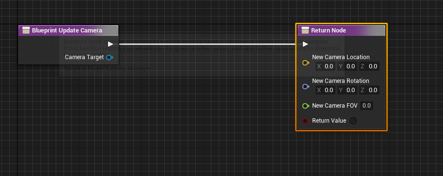

Unreal makes us easy to make a (specific) game. If you want to make a game that the camera always follows the player, it is easy! But if you want to make an RTS game, you might be confused, even Crash Bandicoot camera type, you might found difficulty with it. You might ask "But, Crash Bandicoot camera always the following player, right?", the answer is yes, but in reality, the Crash Bandicoot camera is unique. The camera movement always following where the level goes. That makes it harder for us using Unreal Engine, but if you know how to do it, it easier, so let me introduce you to "Player Camera Manager"

## **WTF is Player Camera Manager?**

Player Camera Manager is a class that have a job to manage camera movement. If you think SpringArmComponent, it is helper only, not the actual controller for camera.



## **So how TF to do it?**

In PlayerCameraManager, you have 2 choice, using Blueprint or C++.

### Blueprint

Override BlueprintUpdateCamera function, and just create custom movement on it! Set return value to true to make enable it, if false, look at C++ implementation.

### C++

Override UpdateViewTargetInternal function, copy paste from the original code on it!

```cpp
void ACustomPCM::UpdateViewTargetInternal(FTViewTarget& OutVT, float DeltaTime){
	if(OutVT.Target){
		FVector OutLocation;
		FVector OutRotation;
		float OutFOV;

		if(BlueprintUpdateCamera(OutVT.Target, OutLocation, OutRotation, OutFOV)){
			OutVT.POV.Location = OutLocation;
			OutVT.POV.Rotation = OutRotaion;
			OutVT.POV.FOV = OutFOV;
		}
		else{
			CameraInfo.UpdateViewTarget(OutVT, GetTransform(), DeltaTime);
		}
	}
}
```

*Important : You only need to change on the else brackets, just leave the rest as it is.*

## **What about Controller (Player Controller)**

Well, because we modified the camera only, the controller is staying as it is. If you want the controller stays the same as PCM, set the Controller rotation the same as PCM.


```cpp hl_lines="14"
void ACustomPCM::UpdateViewTargetInternal(FTViewTarget& OutVT, float DeltaTime){
	if(OutVT.Target){
		FVector OutLocation;
		FVector OutRotation;
		float OutFOV;

		if(BlueprintUpdateCamera(OutVT.Target, OutLocation, OutRotation, OutFOV)){
			OutVT.POV.Location = OutLocation;
			OutVT.POV.Rotation = OutRotaion;
			OutVT.POV.FOV = OutFOV;
		}
		else{
			CameraInfo.UpdateViewTarget(OutVT, GetTransform(), DeltaTime);
			PlayerController->SetControlRotation(OutVT.POV.Rotation);
		}
	}
}
```