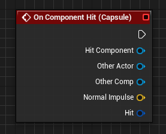
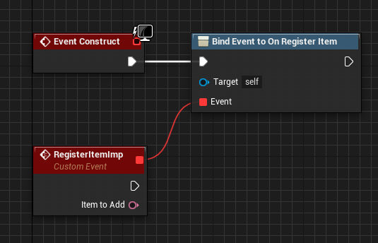

Delegate in Unreal has 2 major type (in cpp, has so many variant such as MULTICAST, EVENT, so on). If you want to implement just for the blueprint version, you can create simple method. Otherwise, you can use real delegate

## Simple, using a method/function

```cpp
// header file
UFUNCTION(BlueprintImplementableEvent)
void ImplementThisOnBlueprint();

//or

UFUNCTION(BLueprintNativeEvent)
void ImplementThisOnBlueprintAndC();

// cpp file
//implementation for the BlueprintNativeEvent
void SomeClass::ImplementThisOnBlueprintAndC_Implementation(){
  //DO Something
}
```

If you using NativeEvent, right click on blueprint event node, and click **"add call to parent function".** Connect the event node to parent node to call the _Implementation version.

## Real delegate

There is 4 types of delegates, Dynamic, SingleCast, MultiCast and Event. Below is the comparison

### Dynamic vs Multi-cast

Dynamic Delegates can be serialized, which means can be bind into Blueprint. Dynamic delegates are also the slowest of all delegate types. Don't use them unless you must.

### Multi-cast Delegates vs Single-cast

Pretty much on point, singlecast is pretty much a direct function pointer, multicast is an array of function pointers. (with some unreal precompiler magic attached)

### Events vs Multi-cast

They are the same thing, if you don't need more than one class to do the broadcast, use an event.

### How can I know which object was called this Delegate? I can use object pointer as variable? Is it safe?

There is no default way that I am aware of, but just passing this works, if set up properly.
If you only need to know who called it (for example, while debugging), print the result of GetName() in the bound function.
You can pass an object pointer as a variable. I have never encountered any issues while doing so.

### Actor Delegate vs Component Delegate

There is no real different, except in the blueprint. Let's take an example OnComponentHit, in the blueprint, you can directly implement this delegate, but actor delegate, you need to create the event and bind it. Here is the comparison

| Component                                |                                   Actor |
| :--------------------------------------- | --------------------------------------: |
|  |  |

## Wiki

[https://wiki.unrealengine.com/Delegates_In_UE4,_Raw_Cpp_and_BP_Exposed](https://wiki.unrealengine.com/Delegates_In_UE4,_Raw_Cpp_and_BP_Exposed)

Note : You can only use this on the Component script. Actor can't expose the event.

### Copied Content

#### Steps

**Signature**

You create the signature of the delegate, which declares what inputs any receiving functions should specify.

```cpp
//RamaMeleeWeapon class .h
DECLARE_DYNAMIC_MULTICAST_DELEGATE_SixParams( FRamaMeleeHitSignature, class AActor*, HitActor, class UPrimitiveComponent*, HitComponent, const FVector&, ImpactPoint, const FVector&, ImpactNormal, FName, HitBoneName, const struct FHitResult&, HitResult );
```

Notice the macro declares that I will be adding 6 parameters, there are similar macros for other quantities of parameters :)

```cpp
 DECLARE_DYNAMIC_MULTICAST_DELEGATE_SixParams
```

**Calling the Delegate**

You call the delegate within the class structure where it was defined, making sure to only execute it if it is currently bound, meaning at least 1 entity is listening for this delegate / event.

.h

```cpp
//.h
//RamaMeleeWeapon class .h

//This should be in the class which calls the delegate, and where the signature was defined
//This is an instance of the signature that was defined above!
FRamaMeleeHitSignature RamaMeleeWeapon_OnHit;
```

.cpp

```cpp
//.cpp
//Only the code that is supposed to initiate the event calls Broadcast()
if(RamaMeleeWeapon_OnHit.IsBound()) //<~~~~
{
	RamaMeleeWeapon_OnHit.Broadcast(Hit.GetActor(), Hit.GetComponent(), Hit.ImpactPoint, Hit.ImpactNormal, Hit.BoneName, Hit);
}
```

Comment from [Darkgaze](https://wiki.unrealengine.com/index.php?title=User:Darkgaze&action=edit&redlink=1): As the official [Multicast docs](https://docs.unrealengine.com/latest/INT/Programming/UnrealArchitecture/Delegates/Multicast/index.html) say:

(...)It is always safe to call Broadcast() on a multi-cast delegate, even if nothing is bound. The only time you need to be careful is if you are using a delegate to initialize output variables, which is generally very bad to do.(...)

So calling InBound() is not necessary. Only in Single-cast delegates.

Responding to the Delegate

Anywhere you want, you can declare functions which receive the parameters by type and name specified in the delegate signature.

```cpp
//Any class can add a function that uses the delegate signature and responds to the Broadcast() event UFUNCTION()void RespondToMeleeDamageTaken(AActor* HitActor, UPrimitiveComponent* HitComponent, const FVector& ImpactPoint, const FVector& ImpactNormal, FName HitBoneName, const FHitResult& HitResult)
UFUNCTION()
void RespondToMeleeDamageTaken(AActor* HitActor, UPrimitiveComponent* HitComponent, const FVector& ImpactPoint, const FVector& ImpactNormal, FName HitBoneName, const FHitResult& HitResult)
```

See below to learn how to bind the delegate instance to this function or any number of functions that are present in class instances anywhere in your code base!

#### UFUNCTION() !

Please note that functions that are responding to delegate broadcasts should be UFUNCTION()!

If your delegate Broadcast stalls the game for a bit and then doesnt work, it's because you did not make one of your receiving functions a UFUNCTION()

<3 Rama

#### Binding To The Delegate

##### Dynamic Delegates

```cpp
RamaMeleeWeaponComp->RamaMeleeWeapon_OnHit.AddDynamic(this, &USomeClass::RespondToMeleeDamageTaken); //see above in wiki
```

##### Multicast Delegates

Binding to non-dynamic requires this syntax:

```cpp
RamaMeleeWeaponComp->RamaMeleeWeapon_OnHit.AddUObject(this, &USomeClass::RespondToMeleeDamageTaken); //see above in wiki
```

[https://docs.unrealengine.com/en-us/Programming/UnrealArchitecture/Delegates/Multicast](https://docs.unrealengine.com/en-us/Programming/UnrealArchitecture/Delegates/Multicast)

##### Non Multicast

Binding a UObject to a non-dynamic, non-multicast delegate requires you to use the following syntax.

```cpp
//in some class cpp fileRamaMeleeWeaponComp->RamaMeleeWeapon_OnHit.BindUObject(this, &USomeClass::RespondToMeleeDamageTaken); //see above in wiki
```

You need to access the delegate where it is stored, in my case this is the RamaMeleeWeaponComponent

The idea is you are telling the delegate instance that it is getting a new binding, to this SomeClass insance, which is why you include the this pointer.

So this code appears where you want to add the binding to the event/delegate, but it must refer to the one signature instance present in the original class instance.

So basically this delegate binding is **an agreement between two instances**, where one instance is of the class that declares and implements the delegate, and the other instance is any ole' class that has declared the function signature to match the delegate signature.

There's nothing abstract here, everything is instances, so you must bind your object instance to the delegate signature instance that is part of the instance of the class that is going to fire off the broadcasting.

This is why I have a pointer to RamaMeleeWeaponComp->RamaMeleeWeapon_OnHit, and I am **also** including the this pointer so that the signature knows about the calling object instance.

The reason it is a this pointer is because the code above is run in the object that wants to bind to the delegate, so this is a self-referencing pointer to the UObject we are binding to the delegate.

#### Raw C++ Class Instances

Raw delegates are used with non UObject classes, like plugin modules.

```cpp
RamaMeleeWeaponComp->RamaMeleeWeapon_OnHit.BindRaw(this, &FSomeRawCPPClass::RespondToMeleeDamageTaken);
```

#### Slate Class Instances

Slate delegates use this syntax:

```cpp
RamaMeleeWeaponComp->RamaMeleeWeapon_OnHit.CreateSP(this, &SSomeSlateClass::RespondToMeleeDamageTaken);
```

#### Binding is Per-Instance

Please note that when you bind to the delegate this is a per-instance process! That is why you need to include the this pointer, because whichever instance you are calling the code in, it is that particular instance whose function will get called when the delegate is broadcasted.

This means you can choose to have only certain instances of a uobject respond to a delegate, or choose to bind or unbind at any time!

#### BP-Friendly Delegates

A BP friendly delegate requires this additional .h code to expose the delegate to Blueprints.

```cpp
//RamaMeleeWeapon.h
UPROPERTY(BlueprintAssignable, Category="Rama Melee Weapon")
FRamaMeleeHitSignature RamaMeleeWeapon_OnHit;
```

BP-friendly Delegates should be DYNAMIC_MULTICAST so they can be serialized (saved/loaded) with the BP graph.

#### Level Blueprint Friendly Delegates

When you've made BP-friendly delegates on objects that you can place in the level, you can simply right click on the object instance in your level -> Add Event and see your new delegate! So nice!

This is an additional benefit of using DYNAMIC_MULTICAST delegates! Multi-cast implies binding multiple of various object instances to the delegate and then firing off the event to everyone from a single .Broadcast, which can include your Level Blueprint as a recipient/listener!

#### Video Example

Here is a video on how a C++ delegate created in an actor component in C++ looks and is called in Blueprints!

The code in this wiki and this video are from my [Melee Weapon Plugin](http://ue4code.com/melee_weapon_system_plugin_per_bone_collision_accuracy)

[http://www.youtube.com/watch?v=aufEB4TCf30&t=5m24s](http://www.youtube.com/watch?v=aufEB4TCf30&t=5m24s)

[Skip to 5:24](http://www.youtube.com/watch?v=aufEB4TCf30&t=5m24s)

#### Further Reading

Epic Documentation: [https://docs.unrealengine.com/latest/INT/Programming/UnrealArchitecture/Delegates/](https://docs.unrealengine.com/latest/INT/Programming/UnrealArchitecture/Delegates/)

#### DYNAMIC_MULTICAST And Other Types

There are other delegate types besides DYNAMIC_MULTICAST that are not quite as versatile when it comes to Blueprints.

Check out the source code of Delegate.h

```cpp
 Runtime/Core/Public/Delegates/Delegate.h
```

For a detailed explanation!

Sample from this file:

```
** *  C++ DELEGATES
 *  -----------------------------------------------------------------------------------------------
 *
 *	This system allows you to call member functions on C++ objects in a generic, yet type-safe way.
 *  Using delegates, you can dynamically bind to a member function of an arbitrary object,
 *	then call functions on the object, even if the caller doesn't know the object's type.
 *
 *	The system predefines various combinations of generic function signatures with which you can
 *	declare a delegate type from, filling in the type names for return value and parameters with
 *	whichever types you need.
 *
 *	Both single-cast and multi-cast delegates are supported, as well as "dynamic" delegates which
 *	can be safely serialized to disk.  Additionally, delegates may define "payload" data which
 *	will stored and passed directly to bound functions.
```

#### Conclusion

Enjoy using delegates in UE4 so that any part of your code base can respond to an event triggered by one section of your code!

Also enjoy exposing delegates via C++ for the rest of your team to use in Blueprints!

Enjoooy!