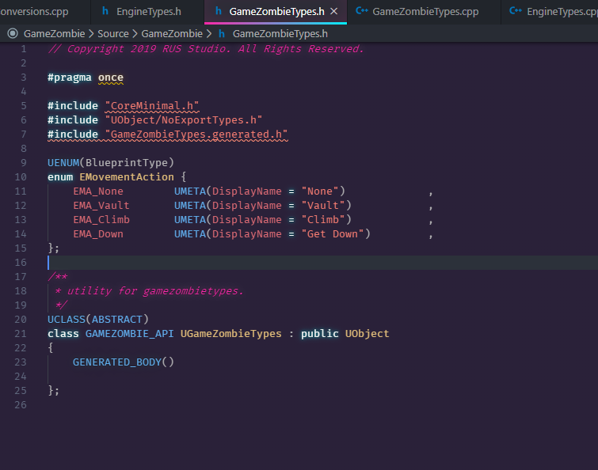

# How to setup?

All types are best to be stored inside a class such as GameTypes.

>Important! Enum/struct is better to be placed on a specific class/file. Why? Unreal can't use forward declaration on enum/struct. When you want to use this type on other class header file, you need to `#include "file.h"` and it will resulting problem. Unreal doesn't like it. So create new file classes like `GameTypes` and place all your enum/struct inside it. If enum/struct only used in one class, it is fine to declared at those classes, but if used in many classes, better on separate file.

Ex :



## Enum

Enum is quite different with c# version. When we create a type of enum, you can do this (as an example)

```
UENUM(BlueprintType)
enum SpecialAction {
	ACT_None	= 0	UMETA(DisplayName = "None"),
	ACT_AutoMove	= 1	UMETA(DisplayName = "Auto Move To"),
	ACT_Vault	= 2	UMETA(DisplayName = "Vault"),
	ACT_Climb1M	= 4	UMETA(DisplayName = "Climb 1M")	,
};
```

To declare the variable, you need TEnumAsByte

```
TEnumAsByte<enum ESpecialAction> SpecialAction;
```

All declaration need that, including params.

## Bitmask / Flags

> Not many people know how to do Bitmask in Unreal. By adding
`meta = (UseEnumValuesAsMaskValuesInEditor="true")`
your blueprint version will act the None value as 1 value.
I'm driving crazy on the process finding this shit! no one mention it! I've found it here
[https://issues.unrealengine.com/issue/UE-32816](https://issues.unrealengine.com/issue/UE-32816)

Bitmask / Flags is not quite different with C# version, just a little bit. I'm using this for example :

```cpp
UENUM(BlueprintType, meta=(Bitflags, UseEnumValuesAsMaskValuesInEditor="true"))
enum class ESpecialAction : uint8 {
	ACT_None	UMETA(DisplayName = "None"),
	ACT_AutoMove	UMETA(DisplayName = "Auto Move To"),
	ACT_Vault	UMETA(DisplayName = "Vault"),
	ACT_Climb1M	UMETA(DisplayName = "Climb 1M")	,
};
ENUM_CLASS_FLAGS(ESpecialAction)

// declaration
//can be set as bitmask in blueprnt
UPROPERTY(EditAnywhere, meta = (Bitmask, BitmaskEnum=ESpecialAction))
uint8 SpecialAction;

//cannot be set as bitmask in blueprint, so use on c++ only
UPROPERTY(EditAnywhere, meta = (Bitmask, BitmaskEnum=ESpecialAction))
ESpecialAction SpecialActionC;="true"))enum class ESpecialAction : uint8 {	ACT_None	UMETA(DisplayName = "None"),	ACT_AutoMove	UMETA(DisplayName = "Auto Move To"),	ACT_Vault	UMETA(DisplayName = "Vault"),	ACT_Climb1M	UMETA(DisplayName = "Climb 1M")	,};ENUM_CLASS_FLAGS(ESpecialAction)// declaration//can be set as bitmask in blueprntUPROPERTY(EditAnywhere, meta = (Bitmask, BitmaskEnum=ESpecialAction))uint8 SpecialAction;//cannot be set as bitmask in blueprint, so use on c++ onlyUPROPERTY(EditAnywhere, meta = (Bitmask, BitmaskEnum=ESpecialAction))ESpecialAction SpecialActionC;
```

- UENUM(BlueprintType) : This will register the enum as an BlueprintType, so you can access it inside Blueprint version
- uint8 : Required when implements the Flags / Bitmask version of enum.
- None = 0 : Must have the 0 version. This will used for checking flag.
- ENUM_CLASS_FLAGS(Enum) : This register your enum as a flags

### Non Blueprint Version

#### Add

```
SpecialAction |= ESpecialAction::ACT_AutoMove;
```

#### Remove

```
SpecialAction &= ~ESpecialAction::ACT_AutoMove;
```

#### Has

```
if((SpecialAction & ESpecialAction::ACT_Vault) != ESpecialAction::ACT_None)
```

#### Not / Reverse

```
~SpecialAction
```

### Blueprint Version (uint8)

No big different, just cast it to the uint8 / the enum type.

#### Add

```
SpecialAction |= (uint8)ESpecialAction::ACT_AutoMove;
```

#### Remove

```
SpecialAction &= (uint8)(~ESpecialAction::ACT_AutoMove);
```

#### Has

```
if((SpecialAction & (uint8)ESpecialAction::ACT_Vault) != (uint8)ESpecialAction::ACT_None)
```

#### Not / Reverse

```
(uint8)(~SpecialAction)
```